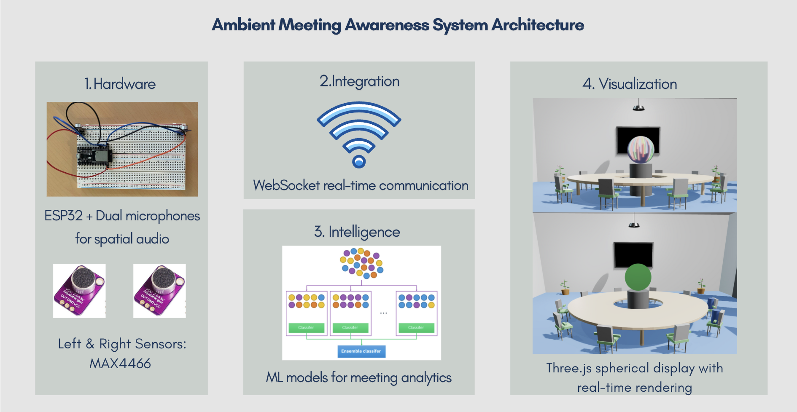

# Intelligent Ambient Data Visualization on Non-Planar Displays

**Master Thesis Project by Dilbar Isakova**  
Erasmus Mundus Joint Master's Degree in Big Data Management and Analytics  
LISN & Inria AVIZ

> A Multi-Modal Machine Learning Approach for Spatial Audio-Visual Analytics in Meeting Room Environments
> 
---

## Table of Contents

- [Project Overview](#project-overview)
- [Research Questions](#research-questions)
- [System Architecture](#system-architecture)
- [Prerequisites](#prerequisites)
- [Hardware Requirements](#hardware-requirements)
- [Software Installation](#software-installation)
- [Project Structure](#project-structure)
- [Getting Started](#getting-started)
- [Running the System](#running-the-system)
- [Machine Learning Pipeline](#machine-learning-pipeline)
- [Visualization Modes](#visualization-modes)
- [Data Collection](#data-collection)
- [Troubleshooting](#troubleshooting)
- [Future Work](#future-work)
- [Acknowledgments](#acknowledgments)

---

## Project Overview

This project explores ambient data visualization on non-planar (spherical) displays for meeting room environmental awareness. The system combines:

- **IoT Hardware**: ESP32 microcontroller with dual-microphone spatial audio array
- **Signal Processing**: Real-time FFT analysis and spatial audio processing
- **Machine Learning**: Random Forest and Gradient Boosting models for meeting analytics
- **3D Visualization**: Three.js with WebGL rendering for spherical ambient displays
- **Real-time Communication**: WebSocket protocol for low-latency data streaming

The system provides ambient environmental awareness through spatial audio visualization, automatically classifying meeting characteristics including speaker count, meeting type, energy level, and engagement scores.

### Key Features

- Real-time spatial audio capture and processing (5 kHz sampling rate)
- Multiple visualization modes (Audio 3D, Waves, Stereo Chart, Activity Chart)
- Machine learning classification of meeting characteristics
- Web-based 3D visualization with parametric display positioning
- Dual-mode operation: live ESP32 data or pre-recorded datasets

---

## Research Questions

This thesis addresses three primary research questions:

**RQ1**: Which display form factors best suit meeting room environments?  
**RQ2**: How can non-planar displays effectively support ambient environmental awareness in collaborative meeting environments?  
**RQ3**: How can machine learning classification enhance the meaningfulness of real-time meeting analytics for ambient display applications?

---

## System Architecture




```
┌─────────────────────────────────────────────────────────────┐
│                    Meeting Room Environment                 │
│                                                             │
│  ┌──────────────┐        ┌──────────────┐                   │
│  │   MAX4466    │        │   MAX4466    │                   │
│  │ Microphone   │◄───────┤ Microphone   │                   │
│  │   (Left)     │        │   (Right)    │                   │
│  └──────┬───────┘        └──────┬───────┘                   │
│         │                       │                           │
│         │  Analog Audio         │                           │
│         └───────┬───────────────┘                           │
│                 │                                           │
│         ┌───────▼────────┐                                  │
│         │  ESP32 Board   │                                  │
│         │  - ADC (12-bit)│                                  │
│         │  - FFT (512pt) │                                  │
│         │  - WiFi Module │                                  │
│         └───────┬────────┘                                  │
│                 │                                           │
│                 │ WebSocket (JSON)                          │
│                 │ Port 81                                   │
└─────────────────┼───────────────────────────────────────────┘
                  │
                  │ WiFi Network
                  │
┌─────────────────▼─────────────────────────────────────────────┐
│              Web Browser Visualization                        │
│                                                               │
│  ┌──────────────────────────────────────────────────────────┐ │
│  │           Three.js Rendering Engine                      │ │
│  │  - WebGL Shaders                                         │ │
│  │  - Spherical Geometry (128×128 subdivisions              │ │
│  │  - Real-time Audio Visualization                         │ │
│  └──────────────────────────────────────────────────────────┘ │
│                                                               │
│  ┌──────────────────────────────────────────────────────────┐ │
│  │           Machine Learning Integration                   │ │
│  │  - Speaker Count Classifier                              │ │
│  │  - Meeting Type Classifier                               │ │
│  │  - Energy Level Classifier                               │ │
│  │  - Engagement Score Regressor                            │ │
│  └──────────────────────────────────────────────────────────┘ │
└───────────────────────────────────────────────────────────────┘
```

### Data Flow Pipeline

1. **Audio Capture**: Dual MAX4466 microphones → ESP32 ADC (5 kHz, 12-bit)
2. **Signal Processing**: Windowed FFT (512 samples, Hamming window, 300-3400 Hz voice filtering)
3. **Feature Extraction**: Energy levels, stereo difference, spatial positioning
4. **WebSocket Transmission**: JSON-formatted real-time data (~0.5s updates)
5. **Visualization Update**: Three.js shader uniforms, real-time rendering
6. **ML Classification**: Optional meeting analytics (speaker count, type, energy, engagement)

---

## Prerequisites

### Software Requirements

- **Operating System**: Windows, macOS, or Linux
- **Arduino IDE**: Version 1.8.19 or later (for ESP32 programming)
- **Python**: Version 3.8 or later (for machine learning pipeline)
- **Web Browser**: Modern browser with WebGL support (Chrome, Firefox, Edge recommended)
- **Git**: For cloning the repository

### Knowledge Prerequisites

- Basic understanding of embedded systems
- Familiarity with JavaScript and web development
- Python programming for data science
- Understanding of audio signal processing concepts (helpful but not required)

---

## Hardware Requirements

### Required Components

| Component | Specification | Quantity | Purpose |
|-----------|--------------|----------|---------|
| **ESP32 Development Board** | Dual-core, WiFi-enabled | 1 | Microcontroller for audio processing |
| **MAX4466 Microphone Amplifier** | Electret microphone with adjustable gain | 2 | Spatial audio capture |
| **Breadboard** | Standard size | 1 | Circuit prototyping |
| **Jumper Wires** | Male-to-male, male-to-female | ~10 | Connections |
| **USB Cable** | Micro-USB or USB-C (depending on ESP32) | 1 | Power and programming |
| **Power Supply** | 5V, 500mA minimum | 1 | Optional: for standalone operation |

### Hardware Wiring Diagram

```
ESP32 Pin Connections:
┌─────────────────┐
│     ESP32       │
│                 │
│  GPIO 35 ◄──────┼──── Left Microphone (MAX4466 OUT)
│  GPIO 34 ◄──────┼──── Right Microphone (MAX4466 OUT)
│  3.3V ──────────┼──── Both MAX4466 VCC
│  GND  ──────────┼──── Both MAX4466 GND
│                 │
└─────────────────┘
```

### Microphone Calibration

1. **Positioning**: Place microphones 5-10 cm apart for optimal stereo separation
2. **Gain Adjustment**: Use onboard potentiometers to match sensitivity between channels
3. **Spatial Testing**: Verify left-right discrimination with test audio sources

---

## Software Installation

### 1. Clone the Repository

```bash
git clone https://github.com/isakovaad/sphereDisplay.git
cd sphereDisplay
```

### 2. Arduino/ESP32 Setup

#### Install Arduino IDE

Download and install from: https://www.arduino.cc/en/software

#### Add ESP32 Board Support

1. Open Arduino IDE
2. Go to **File → Preferences**
3. Add to **Additional Board Manager URLs**:
   ```
   https://raw.githubusercontent.com/espressif/arduino-esp32/gh-pages/package_esp32_index.json
   ```
4. Go to **Tools → Board → Boards Manager**
5. Search for "ESP32" and install "esp32 by Espressif Systems"

#### Install Required Libraries

Go to **Sketch → Include Library → Manage Libraries** and install:

- **ArduinoFFT** (v1.5.6 or later) - For FFT audio analysis
- **WebSocketsServer** (v2.3.6 or later) - For WebSocket communication
- **WiFi** (included with ESP32 board package)
- **ArduinoJson** (v6.19.4 or later) - For JSON serialization

#### Configure WiFi Credentials

1. Open `sketch_jun13a/sketch_jun13a.ino` in Arduino IDE
2. Locate the WiFi configuration section:
   ```cpp
   const char* ssid = "YOUR_WIFI_SSID";
   const char* password = "YOUR_WIFI_PASSWORD";
   ```
3. Replace with your WiFi network credentials
4. **Note**: Ensure ESP32 and your computer are on the same network

#### Upload to ESP32

1. Connect ESP32 via USB
2. Select **Tools → Board → ESP32 Dev Module** (or your specific board)
3. Select **Tools → Port** → [Your ESP32 COM port]
4. Click **Upload** button
5. Wait for compilation and upload to complete
6. Open **Tools → Serial Monitor** (115200 baud) to view ESP32's IP address

### 3. Python Environment Setup

#### Create Virtual Environment (Recommended)

```bash
# Create virtual environment
python -m venv venv

# Activate virtual environment
# On Windows:
venv\Scripts\activate
# On macOS/Linux:
source venv/bin/activate
```

#### Install Python Dependencies

```bash
pip install numpy pandas scikit-learn matplotlib seaborn
pip install librosa soundfile audiomentations
pip install jupyter notebook
pip install websocket-client
```

#### Install Additional ML Libraries

```bash
pip install xgboost  # For Gradient Boosting
pip install scipy    # For signal processing
```

### 4. Web Visualization Setup

The web visualization requires no additional installation - simply open `index.html` in a modern web browser.

**Required Files**:
- `index.html` - Main HTML page
- `main.js` - Three.js visualization logic
- `init.js` - WebSocket and initialization
- `style.css` - Styling
- `ml-styles.css` - Machine learning UI styling
- `ml-integration.js` - ML model integration (if available)

---

## Project Structure

```
sphereDisplay/
│
├── sketch_jun13a/                    # Arduino/ESP32 Code
│   └── sketch_jun13a.ino            # Main ESP32 firmware
│
├── trained_models/                   # Machine Learning Models
│   ├── speaker_count_model.pkl      # Speaker count classifier
│   ├── meeting_type_model.pkl       # Meeting type classifier
│   ├── energy_level_model.pkl       # Energy level classifier
│   └── engagement_model.pkl         # Engagement score regressor
│
├── data_analysis.ipynb              # Jupyter notebook for data exploration
├── data_augmenter.ipynb             # Audio data augmentation pipeline
├── data_collector.ipynb             # Real-time data collection tool
│
├── index.html                       # Main web visualization page
├── main.js                          # Three.js rendering and visualization
├── init.js                          # WebSocket and initialization logic
├── style.css                        # Main stylesheet
├── ml-styles.css                    # ML interface styling
├── ml-integration.js                # ML model integration (deployment)
├── ml_model_server.py               # Python ML inference server (future)
│
├── .DS_Store                        # macOS metadata (ignore)
└── ml_server.log                    # ML server logs (if deployed)
```
NOTE: THe model deployment is not integrated yet. Refer for detailes to the ML part below.

### File Descriptions

#### Hardware/Firmware

- **sketch_jun13a.ino**: ESP32 firmware implementing:
  - Dual-microphone audio capture (5 kHz sampling)
  - FFT analysis with Hamming windowing
  - Voice frequency filtering (300-3400 Hz)
  - WebSocket server for real-time data streaming
  - JSON message formatting

#### Machine Learning

- **data_collector.ipynb**: Interactive tool for collecting labeled audio data from ESP32
  - Real-time WebSocket connection to ESP32
  - Live labeling interface for speaker count, meeting type, energy level
  - Automatic session management and CSV export

- **data_augmenter.ipynb**: Audio data augmentation pipeline
  - Time stretching (0.8x-1.2x)
  - Pitch shifting (±1-2 semitones)
  - Stereo positioning (8 variants)
  - Background noise mixing
  - Meeting flow simulation

- **data_analysis.ipynb**: Exploratory data analysis and model training
  - Feature engineering (36 audio features)
  - Model training (Random Forest, Gradient Boosting)
  - Hyperparameter optimization via GridSearchCV
  - Performance evaluation and visualization

- **trained_models/**: Serialized scikit-learn models (.pkl files)

#### Web Visualization

- **index.html**: Main application interface with:
  - WebSocket connection controls
  - Visualization mode switcher
  - Display height adjustment
  - Meeting simulation controls

- **main.js**: Core Three.js visualization
  - Spherical geometry rendering (128×128 subdivisions)
  - Custom WebGL shaders for audio visualization
  - Real-time uniform updates
  - Multiple visualization modes

- **init.js**: WebSocket client implementation
  - Connection management
  - JSON message parsing
  - Real-time data forwarding to visualization

---

## Getting Started

### Quick Start Guide

#### Step 1: Hardware Assembly

1. Connect microphones to ESP32 as per wiring diagram
2. Adjust microphone gain potentiometers to medium position
3. Connect ESP32 to computer via USB

#### Step 2: Flash ESP32 Firmware

1. Open `sketch_jun13a/sketch_jun13a.ino` in Arduino IDE
2. Configure WiFi credentials
3. Upload to ESP32
4. Note the IP address displayed in Serial Monitor (e.g., `192.168.0.110`)

#### Step 3: Launch Web Visualization

1. Open `index.html` in web browser
2. Enter ESP32 IP address in connection field (e.g., `192.168.0.110`)
3. Click "Connect to ESP32"
4. Verify "Connected" status and live audio data display

#### Step 4: Test System

1. Make sounds near the microphones
2. Observe real-time visualization changes
3. Test left/right spatial audio by making sounds on different sides
4. Switch between visualization modes to explore different representations

---

## Running the System

### Mode 1: Live ESP32 Data

**Best for**: Real-time meeting monitoring and system testing

1. **Ensure ESP32 is powered and connected to WiFi**
   ```bash
   # Check ESP32 serial output
   # Should show: "WiFi connected" and "IP address: X.X.X.X"
   ```

2. **Open web visualization**
   - Launch `index.html` in browser
   - Enter ESP32 IP address
   - Click "Connect to ESP32"

3. **Verify real-time data stream**
   - Audio data display should update ~2 times per second
   - Left/Right mic levels should respond to sounds
   - Stereo difference should reflect speaker position

4. **Explore visualization modes**
   - **Audio 3D**: Directional color mapping (orange = left, green = right)
   - **Waves**: Flowing audio waveform visualization
   - **Stereo Chart**: Left-right channel comparison over time
   - **Activity Chart**: Average audio level histogram

### Mode 2: Pre-recorded Data Playback

**Best for**: Demonstrations, analysis, and consistent testing

1. **Load sample dataset** (if available)
   - Click "Load Real Data" button in web interface
   - System will replay pre-recorded audio session
   - Useful for presentations and debugging

2. **Analyze recorded sessions**
   - Open `data_analysis.ipynb` in Jupyter
   - Load CSV files from data collection
   - Visualize audio patterns and meeting characteristics

### Advanced: Machine Learning Integration

**Note**: ML model deployment is marked as future work in the thesis. Current implementation includes trained models but not real-time inference.

To use trained models for analysis:

```python
# In Jupyter notebook
import pickle
import pandas as pd

# Load trained models
speaker_model = pickle.load(open('trained_models/speaker_count_model.pkl', 'rb'))
meeting_model = pickle.load(open('trained_models/meeting_type_model.pkl', 'rb'))
energy_model = pickle.load(open('trained_models/energy_level_model.pkl', 'rb'))
engagement_model = pickle.load(open('trained_models/engagement_model.pkl', 'rb'))

# Load and prepare your audio features
features = pd.read_csv('your_features.csv')

# Make predictions
speaker_count = speaker_model.predict(features)
meeting_type = meeting_model.predict(features)
energy_level = energy_model.predict(features)
engagement_score = engagement_model.predict(features)
```

---

## Machine Learning Pipeline

### Overview

The ML pipeline classifies meeting characteristics from dual-microphone audio features:

- **Speaker Count**: 1, 2, or 3+ speakers
- **Meeting Type**: Discussion, Presentation, Brainstorm, Argument
- **Energy Level**: Low, Medium, High
- **Engagement Score**: Continuous 0-100 scale (synthetic)

### Dataset Characteristics

| Metric | Value |
|--------|-------|
| Original Recordings | 16 sessions |
| Total Duration | ~91 minutes |
| Augmented Samples | 960 |
| Features per Sample | 36 |
| Sampling Rate | 5 kHz |
| FFT Window Size | 512 samples |

### Feature Engineering

**36 Audio Features** grouped into categories:

#### 1. Temporal Features (9 features)
- Volume variance, mean, median
- Volume trend (slope)
- Speaker change rate
- Activity duration statistics

#### 2. Spatial Features (8 features)
- Stereo difference (mean, std, range)
- Stereo switches (position changes)
- Left/Right dominance patterns

#### 3. Spectral Features (10 features)
- Spectral centroid, bandwidth, rolloff
- Zero-crossing rate
- MFCC coefficients (3)
- Energy distribution

#### 4. Dynamic Features (9 features)
- Peak density
- Silence ratio
- High-activity ratio
- Engagement complexity
- Dynamic range

### Model Training

#### Data Collection

Use `data_collector.ipynb` to gather labeled training data:

```bash
# Start Jupyter
jupyter notebook data_collector.ipynb

# In notebook:
# 1. Enter ESP32 IP address
# 2. Click 'Start Recording'
# 3. Label data in real-time:
#    - Speaker count (1, 2, 3+)
#    - Meeting type (discussion, presentation, etc.)
#    - Energy level (low, medium, high)
#    - Background noise level
# 4. Save session data to CSV
```

#### Data Augmentation

Run `data_augmenter.ipynb` to expand dataset:

```python
# Augmentation techniques applied:
# - Time stretching: 0.8x, 0.9x, 1.1x, 1.2x (4 variants)
# - Pitch shifting: ±1, ±2 semitones (4 variants)
# - Stereo positioning: 8 panning variants
# - Background noise: 6 ambient noise types
# - Meeting flow simulation: 4 conversation patterns
#
# Total: ~60x dataset expansion
```

#### Model Training & Evaluation

Run `data_analysis.ipynb` for complete pipeline:

```python
# 1. Load and preprocess data
# 2. Engineer 36 audio features
# 3. Split train/validation/test sets
# 4. Train Random Forest classifiers
# 5. Train Gradient Boosting regressor
# 6. Hyperparameter optimization via GridSearchCV
# 7. Evaluate performance
# 8. Save trained models
```

### Model Performance

| Model | Algorithm | Accuracy/RMSE | Notes |
|-------|-----------|---------------|-------|
| **Speaker Count** | Random Forest | 73.3% | 3-class problem |
| **Meeting Type** | Random Forest | 95.3% | 4-class problem |
| **Energy Level** | Random Forest | 97.9% | 3-class problem |
| **Engagement Score** | Gradient Boosting | 1.28 RMSE | Continuous 0-100 |

### Hyperparameters (Optimized)

#### Speaker Count Classifier
```python
{
    'n_estimators': 100,
    'max_depth': 10,
    'min_samples_split': 2
}
```

#### Meeting Type Classifier
```python
{
    'n_estimators': 200,
    'max_depth': None,
    'min_samples_split': 2
}
```

#### Energy Level Classifier
```python
{
    'n_estimators': 150,
    'max_depth': 10,
    'min_samples_split': 5
}
```

#### Engagement Score Regressor
```python
{
    'n_estimators': 100,
    'learning_rate': 0.1,
    'max_depth': 5
}
```

---

## Visualization Modes

### 1. Audio 3D Mode

**Purpose**: Real-time spatial audio awareness

**Visual Encoding**:
- **Orange regions**: Left-dominant audio sources
- **Green regions**: Right-dominant audio sources
- **Gradient blending**: Balanced/centered audio
- **Intensity**: Mapped to audio energy level

**Use Cases**:
- Monitor speaker positioning in real-time
- Detect conversation balance
- Ambient awareness during meetings

### 2. Waves Mode

**Purpose**: Organic, flowing audio representation

**Visual Encoding**:
- **Wave patterns**: Multiple layered sinusoidal flows
- **Color palette**: Purple → Magenta → Cyan
- **Movement**: Audio-reactive wave propagation
- **Noise layers**: Organic texture variations

**Use Cases**:
- Aesthetic ambient displays
- Non-distracting environmental awareness
- Meeting energy visualization

### 3. Stereo Chart Mode

**Purpose**: Analytical left-right comparison

**Visual Encoding**:
- **Left channel**: Orange bars
- **Right channel**: Green bars
- **Time axis**: Horizontal progression
- **Level axis**: Decibel scale

**Use Cases**:
- Detailed audio analysis
- Spatial audio debugging
- Meeting documentation

### 4. Activity Chart Mode

**Purpose**: Meeting engagement overview

**Visual Encoding**:
- **Bars**: Average audio level per time segment
- **Height**: Audio energy intensity
- **Color**: Activity level gradient
- **Timeline**: Meeting progression

**Use Cases**:
- Post-meeting analysis
- Engagement assessment
- Meeting quality metrics

### Parametric Display Controls

**Height Adjustment**: 5 preset positions
- **Lowest**: Eye-level for seated participants
- **Medium**: Above table surface
- **Highest**: Ceiling-mounted configuration

**Meeting Simulation**: "Add Person" button
- Simulates occupancy changes
- Updates CO2 visualization (demo mode)
- Tests display responsiveness

---

## Data Collection

### Collecting Training Data

#### Prerequisites

- ESP32 connected and streaming audio data
- Jupyter Notebook running
- Quiet meeting room for controlled recordings

#### Step-by-Step Process

1. **Launch Data Collector**
   ```bash
   jupyter notebook data_collector.ipynb
   ```

2. **Configure Connection**
   ```python
   # Enter ESP32 IP address when prompted
   ESP32_IP = "192.168.0.110"  # Your ESP32's IP
   ```

3. **Start Recording Session**
   - Click `[s] Start/Stop recording`
   - System begins capturing audio features
   - Real-time audio levels displayed

4. **Apply Labels During Recording**
   - Click `[l] Add label` at any time
   - Enter current meeting characteristics:
     - **Speaker Count**: 1, 2, 3, 4, or 5+
     - **Meeting Type**: discussion, presentation, brainstorm, argument
     - **Energy Level**: low, medium, high
     - **Background Noise**: none, low, medium, high

5. **Monitor Data Quality**
   - View recent audio data with `[v]`
   - Check stereo difference for spatial accuracy
   - Verify audio levels are within expected range (40-80 dB)

6. **Stop and Save Session**
   - Click `[s]` again to stop recording
   - Data automatically saved to CSV with timestamp
   - Session metadata logged to `labels/sessions_master.csv`

#### Best Practices

- **Recording Duration**: 3-5 minutes per session minimum
- **Variety**: Capture diverse meeting scenarios
- **Label Granularity**: Apply labels every 30-60 seconds
- **Spatial Coverage**: Record audio from different positions
- **Energy Levels**: Include quiet, moderate, and energetic discussions

#### Dataset Organization

```
data/
├── recordings/
│   ├── session_20250620_130013.csv
│   ├── session_20250620_145139.csv
│   └── ...
└── labels/
    └── sessions_master.csv  # Master label registry
```

### Data Augmentation

After collecting baseline data, run augmentation pipeline:

```bash
jupyter notebook data_augmenter.ipynb
```

This expands your dataset by ~60x through:
- Time-domain transformations
- Pitch variations
- Spatial positioning changes
- Background noise injection
- Meeting flow simulations

---

## Troubleshooting

### ESP32 Connection Issues

#### Problem: "Connection Failed" or "WebSocket Error"

**Solutions**:

1. **Verify ESP32 is on same WiFi network**
   ```cpp
   // Check serial monitor output
   // Should show: "WiFi connected" and IP address
   ```

2. **Check firewall settings**
   - Allow WebSocket connections on port 81
   - Temporarily disable firewall to test

3. **Verify IP address**
   - Use Serial Monitor to confirm ESP32 IP
   - Try ping from command line:
     ```bash
     ping 192.168.0.110
     ```

4. **WebSocket port conflict**
   - Ensure no other service is using port 81
   - Try changing port in both ESP32 code and web interface

#### Problem: Audio data not updating

**Solutions**:

1. **Check microphone connections**
   - Verify GPIO 34 and 35 connections
   - Ensure VCC and GND are properly connected

2. **Adjust microphone gain**
   - Turn potentiometers clockwise to increase sensitivity
   - Test with louder sounds first

3. **Inspect serial monitor**
   - Look for FFT processing errors
   - Check for ADC overflow warnings

4. **Restart ESP32**
   - Press reset button or power cycle
   - Allow 5-10 seconds for WiFi reconnection

### Visualization Issues

#### Problem: Black screen or no 3D content

**Solutions**:

1. **Check WebGL support**
   - Visit: https://get.webgl.org/
   - Update graphics drivers if needed

2. **Browser console errors**
   - Press F12 to open Developer Tools
   - Check Console tab for JavaScript errors
   - Clear browser cache

3. **Three.js loading**
   - Verify `main.js` and `init.js` are loading
   - Check Network tab for 404 errors

#### Problem: Visualization lag or stuttering

**Solutions**:

1. **Reduce geometry resolution**
   ```javascript
   // In main.js, change:
   const geometry = new THREE.SphereGeometry(sphereRadius, 64, 64);
   // Instead of 128, 128
   ```

2. **Close other browser tabs**
   - WebGL is resource-intensive
   - Free up GPU memory

3. **Lower update frequency**
   - Reduce WebSocket message rate in ESP32 code

### Machine Learning Issues

#### Problem: Models not training properly

**Solutions**:

1. **Insufficient data**
   - Collect at least 16 diverse recording sessions
   - Ensure label balance across classes

2. **Feature extraction errors**
   - Check for NaN values in feature matrix
   - Verify audio data is properly formatted

3. **Overfitting warnings**
   - Increase training data via augmentation
   - Reduce model complexity (max_depth, n_estimators)

4. **Poor model performance**
   - Verify label accuracy in training data
   - Check feature normalization
   - Try different hyperparameters

#### Problem: Model loading fails

**Solutions**:

1. **Version mismatch**
   ```python
   # Check scikit-learn version
   import sklearn
   print(sklearn.__version__)
   # Ensure same version as model was trained with
   ```

2. **Corrupted pickle files**
   - Retrain and save models again
   - Check file integrity

### Audio Quality Issues

#### Problem: Excessive noise in audio capture

**Solutions**:

1. **Microphone gain too high**
   - Reduce gain using potentiometers
   - Aim for 50-70 dB range for normal speech

2. **Electrical interference**
   - Keep wires away from power sources
   - Add small capacitor (0.1µF) between VCC and GND

3. **Poor grounding**
   - Ensure solid GND connection
   - Use twisted pair wiring for analog signals

#### Problem: Stereo channels imbalanced

**Solutions**:

1. **Microphone sensitivity mismatch**
   - Calibrate using identical test sounds
   - Adjust gain potentiometers independently

2. **Physical positioning**
   - Maintain equal distance from sound sources during calibration
   - Ensure microphones face same direction

### Python Environment Issues

#### Problem: Import errors or missing packages

**Solutions**:

1. **Reinstall dependencies**
   ```bash
   pip install --upgrade -r requirements.txt
   ```

2. **Virtual environment not activated**
   ```bash
   # Windows
   venv\Scripts\activate
   # macOS/Linux
   source venv/bin/activate
   ```

3. **Jupyter kernel mismatch**
   ```bash
   python -m ipykernel install --user --name=venv
   # Select 'venv' kernel in Jupyter
   ```

---

## Future Work

### Machine Learning Enhancements

#### 1. Real-time ML Inference Deployment

**Current State**: Models are trained but not integrated into live visualization

**Implementation Path**:

```python
# Future ml_model_server.py architecture
from flask import Flask, request, jsonify
import pickle
import numpy as np

app = Flask(__name__)

# Load trained models
models = {
    'speaker_count': pickle.load(open('trained_models/speaker_count_model.pkl', 'rb')),
    'meeting_type': pickle.load(open('trained_models/meeting_type_model.pkl', 'rb')),
    'energy_level': pickle.load(open('trained_models/energy_level_model.pkl', 'rb')),
    'engagement': pickle.load(open('trained_models/engagement_model.pkl', 'rb'))
}

@app.route('/predict', methods=['POST'])
def predict():
    features = request.json['features']
    predictions = {
        'speaker_count': models['speaker_count'].predict([features])[0],
        'meeting_type': models['meeting_type'].predict([features])[0],
        'energy_level': models['energy_level'].predict([features])[0],
        'engagement_score': models['engagement'].predict([features])[0]
    }
    return jsonify(predictions)

if __name__ == '__main__':
    app.run(port=5000)
```

**Web Integration**:
- Add HTTP requests from `ml-integration.js` to Flask server
- Display ML predictions in real-time visualization UI
- Update spherical display based on classified meeting characteristics

#### 2. Advanced Neural Network Architectures

**Sequential Models for Temporal Patterns**:
- **LSTM Networks**: Capture conversation flow and turn-taking dynamics
- **Transformer Models**: Attention mechanisms for long-range dependencies
- **Temporal CNNs**: Multi-scale temporal feature extraction

**Multimodal Integration**:
- Combine audio with video (facial expressions, gestures)
- Environmental sensors (temperature, CO2, humidity)
- Physiological monitoring (heart rate, galvanic skin response)

#### 3. Dataset Expansion

**Diversity Requirements**:
- Multiple languages and accents
- Different room acoustics and sizes
- Cultural conversation patterns
- Industry-specific meeting types (medical, legal, technical)
- Remote/hybrid meeting scenarios

**Scale Goals**:
- 500+ recording sessions
- 50+ hours of labeled audio
- 10,000+ augmented training samples


### Visualization Improvements

#### 1. Advanced Shader Effects

**Proposed Enhancements**:
- Particle systems for engagement bursts
- Fluid dynamics simulations for conversation flow
- Heat maps for speaker position history
- Frequency spectrum visualizations (3D spectrograms)

#### 2. Multi-Display Synchronization

**Use Case**: Large meeting rooms with multiple displays

```javascript
// Synchronization protocol
class DisplaySync {
    constructor(displayId, coordinatorIP) {
        this.displayId = displayId;
        this.coordinator = new WebSocket(`ws://${coordinatorIP}:82`);
        this.syncState();
    }
    
    syncState() {
        this.coordinator.onmessage = (event) => {
            const syncData = JSON.parse(event.data);
            this.updateVisualization(syncData);
        };
    }
}
```

#### 3. Adaptive Visualization

**Context-Aware Display Modes**:
- Automatic mode switching based on meeting type
- Brightness adaptation to room lighting
- Complexity adjustment based on viewing distance
- Color palette adaptation for accessibility


## Technical Background

### Key Concepts

#### Ambient Visualization

Ambient visualization operates in peripheral awareness, providing environmental information without demanding explicit attention. Unlike traditional dashboards requiring focused interaction, ambient displays follow "calm technology" principles where:

- Information is glanceable and non-intrusive
- Visual encoding supports peripheral perception
- Primary tasks remain uninterrupted
- Awareness is maintained without cognitive overhead

#### Spatial Audio Processing

The dual-microphone system captures spatial characteristics through:

**Stereo Difference Calculation**:
```
Level_difference = 20 × log₁₀(|L[k]| / |R[k]|)
```

**Voice Frequency Filtering**: 300-3400 Hz band captures human speech while rejecting environmental noise

**FFT Analysis**: 512-point window with Hamming function balances frequency resolution (~10 Hz bins) and temporal responsiveness (~0.1s windows)

#### Machine Learning Classification

**Ensemble Methods** combine multiple weak learners:
- **Random Forest**: Bootstrap aggregating (bagging) of decision trees
- **Gradient Boosting**: Sequential training where each tree corrects previous errors

**Feature Importance**: Models identify which audio characteristics most predict meeting type, enabling interpretable analytics

### System Performance Characteristics

| Metric | Value | Notes |
|--------|-------|-------|
| **Latency (E2E)** | ~500ms | ESP32 processing + network + rendering |
| **Audio Sampling** | 5 kHz | Sufficient for voice (Nyquist: 2.5 kHz max) |
| **Update Rate** | ~2 Hz | Balance of statistical robustness and responsiveness |
| **WebSocket Bandwidth** | ~5 KB/s | JSON messages with audio features |
| **Browser FPS** | 60 FPS | Three.js rendering with WebGL |
| **ML Inference** | N/A | Currently offline (future: <100ms target) |

### Dependencies and Libraries

#### ESP32 Firmware
```cpp
#include <WiFi.h>                    // ESP32 WiFi library
#include <WebSocketsServer.h>        // Real-time communication
#include <arduinoFFT.h>              // Fast Fourier Transform
#include <ArduinoJson.h>             // JSON serialization
#include <driver/adc.h>              // Low-level ADC control
```

#### Python Environment
```python
import numpy as np                   # Numerical computing
import pandas as pd                  # Data manipulation
import sklearn                       # Machine learning
import librosa                       # Audio processing
import soundfile                     # Audio I/O
import audiomentations               # Data augmentation
import matplotlib, seaborn           # Visualization
```

#### Web Visualization
```javascript
// Three.js (r128) - 3D rendering engine
// WebSocket API - Real-time communication
// Native WebGL - Hardware-accelerated graphics
```

---

## Citation

If you use this project in your research, please cite:

```bibtex
@mastersthesis{isakova2025ambient,
  title={Intelligent Ambient Data Visualization on Non-Planar Displays: 
         A Multi-Modal Machine Learning Approach for Spatial Audio-Visual Analytics},
  author={Isakova, Dilbar},
  year={2025},
  school={Universit\'e Paris-Saclay, CentraleSupelec},
  type={Master's Thesis},
  note={Erasmus Mundus Joint Master's Degree in Big Data Management and Analytics}
}
```

---

## Acknowledgments <3

### Supervisors

- **Prof. Anastasia Bezerianos** - Université Paris-Saclay
- **Dr. Petra Isenberg** - Inria, Research Director
- **Dr. Tobias Isenberg** - Inria, Research Director

### Collaborators

- **Erwan Achat** - INRIA Laboratory Colleague (Dual-microphone array configuration)

### Project Partners

- **tVISt Project Partners** - Valuable design feedback and project guidance
- **INRIA AVIZ Team** - Survey participants and data collection support

### Institutions

- **Université Paris-Saclay** - Academic institution
- **CentraleSupélec** - Partner institution
- **Inria Saclay** - Research laboratory
- **Erasmus Mundus BDMA Program** - Master's program support

---

## License

This project is part of academic research conducted at LISN and Inria AVIZ. 

**For Academic Use**: Citation and acknowledgment required  
**For Commercial Use**: Please contact the author and supervisors

**Copyright © 2025 Dilbar Isakova**

---

## Contact

**Author**: Dilbar Isakova  
**Email**: dilbar.isakova@student-cs.fr  
**Institution**: Université Paris-Saclay, Inria AVIZ  
**GitHub Repository**: https://github.com/isakovaad/sphereDisplay

**Thesis Date**: August 31, 2025

---

## 🔗 Related Resources

### Academic Papers

- White, S., Feiner, S. (2009). "SiteLens: Situated Visualization Techniques for Urban Site Visits"
- Ren, Y., et al. (2025). "Multi-dimensional Feature Extraction for Audio Classification"
- Zhang, Z., et al. (2013). "Ensemble Methods in Environmental Audio Classification"

### Technical Documentation

- **ESP32 Datasheet**: https://www.espressif.com/sites/default/files/documentation/esp32_datasheet_en.pdf
- **Three.js Documentation**: https://threejs.org/docs/
- **ArduinoFFT Library**: https://github.com/kosme/arduinoFFT
- **WebSocket Protocol**: https://datatracker.ietf.org/doc/html/rfc6455

### Tools and Frameworks

- **Arduino IDE**: https://www.arduino.cc/en/software
- **scikit-learn**: https://scikit-learn.org/
- **librosa (Audio Analysis)**: https://librosa.org/
- **Jupyter Notebook**: https://jupyter.org/

---

## Appendix: Common Commands

### ESP32 Development

```bash
# Compile without uploading
arduino-cli compile --fqbn esp32:esp32:esp32 sketch_jun13a/

# Upload to ESP32
arduino-cli upload -p /dev/ttyUSB0 --fqbn esp32:esp32:esp32 sketch_jun13a/

# Monitor serial output
arduino-cli monitor -p /dev/ttyUSB0 -c baudrate=115200
```

### Python Data Science

```bash
# Start Jupyter
jupyter notebook

# Run specific notebook
jupyter nbconvert --execute --to html data_analysis.ipynb

# Export trained model
python -c "import pickle; pickle.dump(model, open('model.pkl', 'wb'))"

# Load and test model
python -c "import pickle; model = pickle.load(open('model.pkl', 'rb')); print(model.score(X_test, y_test))"
```

### Web Development

```bash
# Start local HTTP server (for testing)
python -m http.server 8000
# Then open: http://localhost:8000/index.html

# Live reload development (using VS Code Live Server extension)
# Right-click index.html → "Open with Live Server"
```

### Git Workflow

```bash
# Clone repository
git clone https://github.com/isakovaad/sphereDisplay.git

# Check status
git status

# Pull latest changes
git pull origin main

# Commit changes
git add .
git commit -m "Description of changes"
git push origin main
```

---

## Learning Resources

### For Newcomers to Audio Signal Processing

1. **"The Scientist and Engineer's Guide to Digital Signal Processing"** by Steven W. Smith (Free online)
2. **YouTube**: 3Blue1Brown - "But what is the Fourier Transform?"
3. **Course**: Coursera - "Audio Signal Processing for Music Applications"

### For Embedded Systems Development

1. **ESP32 Official Documentation**: https://docs.espressif.com/
2. **Book**: "Programming ESP32 with Arduino IDE" by Kolban
3. **Forum**: ESP32.com community forums

### For Machine Learning in Audio

1. **Book**: "Neural Networks for Audio Signal Processing" by Mann & Haykin
2. **Tutorial**: Librosa audio feature extraction tutorials
3. **Course**: Fast.ai - "Practical Deep Learning for Coders"

### For 3D Web Graphics

1. **Three.js Journey**: https://threejs-journey.com/
2. **WebGL Fundamentals**: https://webglfundamentals.org/
3. **Book**: "Interactive Computer Graphics with WebGL" by Angel & Shreiner

---

**Last Updated**: September 2025  

---
